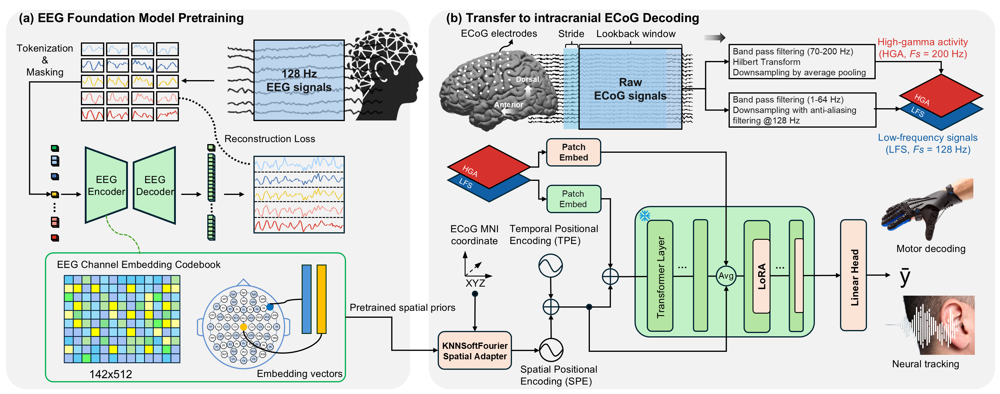

# CORTEG

**Foundation Models Enable Cross-Modality Representation Transfer from Scalp to Intracranial Brain Recordings**

> Adapt a frozen scalp-EEG foundation model to intracranial ECoG decoding —
> calibrate to a new patient in **10–30 minutes** on a single GPU.

[](https://arxiv.org/abs/TODO)
[](https://liuyinyang1101.github.io/CORTEG/)
[](LICENSE)



## Motivation

Intracranial ECoG offers high-SNR access to cortical activity, but each
recording is short, patient-specific, and electrode layouts vary, so most
ECoG decoders are trained per-subject and ignore information shared across
patients. Scalp-EEG foundation models, by contrast, are pretrained on
millions of recordings — but they have never been systematically adapted
*down into the skull*. The question CORTEG asks is whether the
representations learned from extracranial EEG are useful for intracranial
ECoG, and whether a population model can be deployed to a new patient
without retraining from scratch.

## What CORTEG is

A small set of trainable components wrapped around a frozen EEG foundation
model:

- **Frozen [ST-EEGFormer](https://github.com/LiuyinYang1101/STEEGFormer) backbone** —
  pretrained on 128-Hz scalp EEG with an EEG channel-embedding codebook.
- **KNNSoftFourier spatial adapter** — maps each ECoG electrode's 3-D MNI
  coordinate into the pretrained EEG embedding space (soft k-NN over the
  codebook + a learnable Fourier residual).
- **Dual-stream tokenization** — low-frequency (1–64 Hz) + high-gamma
  (70–200 Hz) tokens merged before the last transformer blocks.
- **LoRA on the last 4 blocks**, regression head, and the spatial adapter
  are the *only* trainable parameters (≈297K total).
- **Two-stage LOO-FT** — pool on N − 1 patients, then fine-tune the
  adapter + LoRA + head on the held-out patient in minutes.

## Key findings

- **Cross-modality pretraining transfers.** Pooled CORTEG reaches the
  highest mean correlation among compared methods on both tasks: r=0.554
  on Stanford finger (n=9) and r=0.339 on Ghent audio (n=16), beating the
  strongest task-specific deep baselines.
- **LOO-FT matches pooled training.** A new patient calibrates in 10–30 min
  on a single GPU and lands within ties of the pooled upper bound
  (Wilcoxon p=0.65 finger, p=0.82 audio).
- **The signal is the EEG pretraining, not the architecture.** Replacing
  ST-EEGFormer with a random init drops r by 0.044 (finger) / 0.183 (audio);
  swapping in LaBraM, CBraMod, or MantisV2 backbones drops r by 0.18–0.36
  on finger.

## Headline results — Stanford finger (n=9) and Ghent audio (n=16)

Pearson r (± cross-subject SD). Best per column in **bold**, second-best in *italic*.

| Method | Trainable params | Finger (n=9) | Audio (n=16) |
| --- | ---: | ---: | ---: |
| Ridge (HGA) | — | 0.336 ± 0.095 | 0.175 |
| HiLoFuseNet | 334 K | 0.534 ± 0.138 | *0.259 ± 0.203* |
| CNN-LSTM | 557 K | 0.411 ± 0.124 | 0.261 ± 0.195 |
| DeepFingerNet | 1.16 M | *0.542 ± 0.129* | 0.085 ± 0.144 |
| **CORTEG (pooled)** | **297 K** | **0.554 ± 0.154** | **0.339 ± 0.170** |
| CORTEG (LOO-FT) | 297 K | 0.551 ± 0.147 | 0.331 ± 0.184 |

Full table, ablations, and per-subject paired tests: see the paper.

## Repository scope

This release reproduces all paper results on the **public Stanford
fingerflex dataset**. The Ghent speech-envelope dataset is private and is
**not** redistributed; its predictions are included in the live demo for
visualization only.

```
models/steegformer/   ST-EEGFormer backbone, KNNSoftFourier spatial adapter, LoRA
models/               LaBraM / CBraMod / classical baselines
data/                 Stanford loader, splits, z-score scalers, collate
train/                Training engine, early-stopping, LR schedule
experiments/          Runner scripts (CORTEG + every baseline)
configs/              ST-EEGFormer Small/Base/Large JSONs
scripts/              Paper-aligned reproduction shell scripts (one per table/figure)
docs/                 Live interactive demo (Three.js + Plotly, no backend)
```

| Paper artefact | Script |
| --- | --- |
| Table 1, CORTEG pooled (Stanford) | `scripts/table1_corteg_pooled_stanford.sh` |
| Table 1, CORTEG LOO-FT | `scripts/table1_corteg_loo_ft.sh <subject>` |
| Table 1, classical baselines | `scripts/table1_classical_baselines.sh` |
| Table 2, ablations | `scripts/table2_ablations.sh` |
| Fig 2(b,d), scaling + low-data | `scripts/fig2_scaling_and_lowdata.sh` |

Full reproduction recipe: [`REPRODUCE.md`](REPRODUCE.md).

## Install

```bash
git clone https://github.com/LiuyinYang1101/CORTEG.git
cd CORTEG
conda create -n corteg python=3.11 -y && conda activate corteg
pip install -e .
```

Tested on Ubuntu 24.04 with PyTorch 2.11 / CUDA 12.8 on an RTX 5090.

## Quick start

1. **Data.** See [`DATASETS.md`](DATASETS.md) for the Stanford fingerflex
   download instructions.
2. **Pretrained weights.** See [`CHECKPOINTS.md`](CHECKPOINTS.md) for both the
   ST-EEGFormer EEG-FM backbone and the released CORTEG adapter.
3. **Set environment.**
   ```bash
   export CORTEG_DATA_ROOT=$HOME/workspace/datasets/stanford_ecog
   export ECOG_PRETRAINED_ROOT=$HOME/workspace/datasets/pretrained_eeg_mae
   export CORTEG_OUTPUT_ROOT=$HOME/workspace/outputs/corteg
   ```
4. **Reproduce Table 1, CORTEG pooled:**
   ```bash
   bash scripts/table1_corteg_pooled_stanford.sh
   ```
   ~6–12 GPU-hours on a single RTX 5090.

## Interactive demo

`docs/` is a static, single-page site (Three.js + Plotly, no backend) that
visualises ground-truth vs. predicted trajectories across 9 Stanford subjects
× 16 Ghent subjects × a curated set of models matched to the paper's
Table 1 + key ablation rows. Live at
[liuyinyang1101.github.io/CORTEG](https://liuyinyang1101.github.io/CORTEG/),
or locally:

```bash
cd docs && python -m http.server 8000   # open http://localhost:8000
```

## License

Code: MIT (see [LICENSE](LICENSE)). The pretrained ST-EEGFormer backbone is
distributed under its own license — see [CHECKPOINTS.md](CHECKPOINTS.md).
Ghent dataset: not included.

## Citation

```bibtex
@misc{corteg2026,
  title  = {CORTEG: Foundation Models Enable Cross-Modality Representation Transfer
            from Scalp to Intracranial Brain Recordings},
  author = {TODO: replace with arXiv author list},
  year   = {2026},
  eprint = {TODO},
  archivePrefix = {arXiv}
}
```
