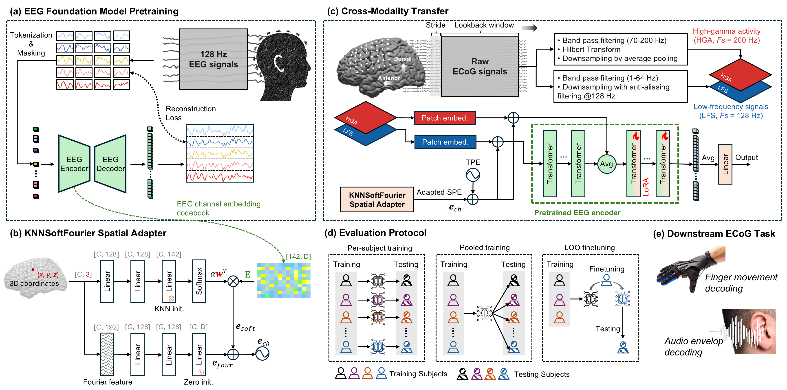

# CORTEG

**Foundation Models Enable Cross-Modality Representation Transfer from Scalp to Intracranial Brain Recordings**

[](#citation)
[](https://arxiv.org/abs/2605.10337)
[](https://liuyinyang1101.github.io/CORTEG/)
[](LICENSE)

CORTEG adapts a pretrained **scalp-EEG foundation model** to **intracranial ECoG** decoding,
learns across patients, and calibrates to a new patient in **10–30 minutes** on a single GPU.



## Method

A small set of trainable components (≈297K parameters) around a frozen
[ST-EEGFormer](https://github.com/LiuyinYang1101/STEEGFormer) backbone:

- **KNNSoftFourier spatial adapter**: maps each electrode's 3-D MNI coordinate into the
  pretrained EEG channel-embedding space.
- **Dual-stream tokenizer**: low-frequency and high-gamma tokens, fused before the last
  four transformer blocks.
- **LoRA** on those last four blocks, plus a linear readout.
- **Leave-one-subject-out fine-tuning (LOO-FT)**: train once on N − 1 patients, then
  calibrate briefly on the new one.

## Results

Pearson r (± cross-subject SD), paper Table 1.

| Method | Finger (n=9) | Audio (n=16) |
| --- | ---: | ---: |
| Ridge (HGA) | 0.336 ± 0.095 | 0.175 |
| HiLoFuseNet | 0.534 ± 0.138 | 0.259 ± 0.203 |
| DeepFingerNet | 0.542 ± 0.129 | 0.085 ± 0.144 |
| BrainBERT | 0.053 ± 0.056 | 0.057 ± 0.066 |
| PopT | 0.063 ± 0.046 | 0.039 ± 0.064 |
| Brant | 0.028 ± 0.031 | 0.022 ± 0.035 |
| CORTEG (per-subject) | 0.539 ± 0.140 | 0.250 ± 0.226 |
| CORTEG (LOO-FT) | 0.551 ± 0.147 | 0.331 ± 0.184 |
| **CORTEG (pooled)** | **0.554 ± 0.154** | **0.339 ± 0.170** |

HiLoFuseNet and DeepFingerNet finger values are from their papers; FM rows are each
model's best adaptation (App. Table 18); Ridge audio is evaluated continuously (no SD).

- Pooled CORTEG has the highest mean correlation on both tasks. The finger gain is not
  significant at n=9; the audio gain is (Bonferroni-corrected p < 0.01).
- LOO-FT matches pooled training, so a new patient needs only the short Stage-2
  calibration.
- Intracranial foundation models (BrainBERT, PopT, Brant) transfer poorly to these
  continuous regression tasks, but do well on BrainTreebank classification, where CORTEG
  is competitive (word vs non-word AUROC 0.749 vs PopT 0.779) and best on sentence
  position (0.638).

## What is in this repository

- CORTEG on the two **public** datasets: Stanford *fingerflex* (finger regression) and
  BrainTreebank (two word-level classification tasks).
- The intracranial foundation-model comparison (BrainBERT, PopT, Brant) on both.
- The trained Stanford adapter (`checkpoints/`), a quickstart notebook and an
  interactive demo.
- The per-cell result files behind the published tables (`paper_cells/`), which reprint
  them on a CPU.

The audio dataset (Ghent) is private and not included. Ablation, backbone-swap and
baseline-decoder code is not part of this release; see
[REPRODUCING.md](REPRODUCING.md#scripts-and-scope) for the full list.

```
models/steegformer/   backbone, KNNSoftFourier adapter, LoRA
data/                 Stanford and BrainTreebank loaders
train/                training loop, early stopping, LR schedule
experiments/          CORTEG and intracranial-FM runners
scripts/              one script per paper table, plus the table aggregators
checkpoints/          released CORTEG adapter + manifest
notebooks/            quickstart.ipynb
docs/                 interactive demo
```

## Install

```bash
git clone https://github.com/LiuyinYang1101/CORTEG.git && cd CORTEG
conda create -n corteg python=3.11 -y && conda activate corteg
pip install -e .                # add ".[ieeg-fm]" for BrainBERT / PopT
```

Download the frozen ST-EEGFormer Small backbone (376 MB):

```bash
mkdir -p "$CORTEG_PRETRAINED_ROOT/experiment3_small"
curl -L -o "$CORTEG_PRETRAINED_ROOT/experiment3_small/checkpoint-300.pth" \
  https://github.com/LiuyinYang1101/STEEGFormer/releases/download/ST-EEGFormer-small/checkpoint-300.pth
```

## Quick start

Start with [`notebooks/quickstart.ipynb`](notebooks/quickstart.ipynb): it loads the
released adapter and reproduces a published per-subject score. In code:

```python
from load_corteg import load_corteg, predict

model = load_corteg(C_in=46, T_in=128, ecog_xyz_mm=xyz, d_out=5, device="cuda")
y = predict(model, x_lo, x_hi)      # low-frequency (N,C,128) + high-gamma (N,C,200) -> (N,5)
```

## Reproducing the paper

| Paper result | Command |
| --- | --- |
| Table 1, CORTEG pooled | `bash scripts/table1_corteg_pooled_stanford.sh` |
| Table 1, CORTEG LOO-FT | `bash scripts/table1_corteg_loo_ft.sh <subject>` |
| Table 1, intracranial FMs | `bash scripts/table1_ieeg_fm_stanford.sh` |
| Table 3, CORTEG on BrainTreebank | `bash scripts/table3_corteg_braintreebank.sh` |
| Table 3, intracranial FMs on BrainTreebank | `bash scripts/table3_ieeg_fm_braintreebank.sh` |
| Reprint the published tables (CPU) | `python scripts/aggregate_btb.py`, `python scripts/aggregate_fm.py` |

Data layout, environment variables, expected values, verification status and notes on
where the code differs from the paper text are in **[REPRODUCING.md](REPRODUCING.md)**.

## Demo

[liuyinyang1101.github.io/CORTEG](https://liuyinyang1101.github.io/CORTEG/) plots true vs
predicted trajectories for every subject (or run `cd docs && python -m http.server`).

## Citation

```bibtex
@inproceedings{yang2026corteg,
  title     = {{CORTEG}: Foundation Models Enable Cross-Modality Representation Transfer
               from Scalp to Intracranial Brain Recordings},
  author    = {Yang, Liuyin and Sun, Qiang and Van Dyck, Bob and Calvo Merino, Eva and
               Van Hulle, Marc M.},
  booktitle = {Advances in Neural Information Processing Systems (NeurIPS)},
  year      = {2026}
}
```

Liuyin Yang and Qiang Sun contributed equally. Code under the MIT [license](LICENSE); the
ST-EEGFormer weights carry their own license.
